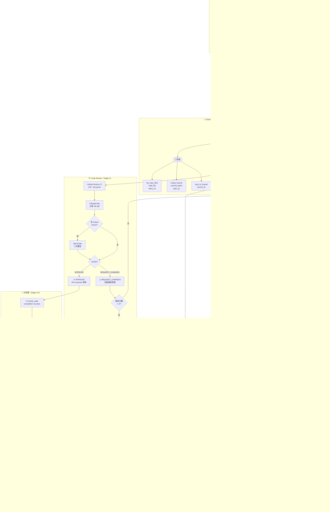
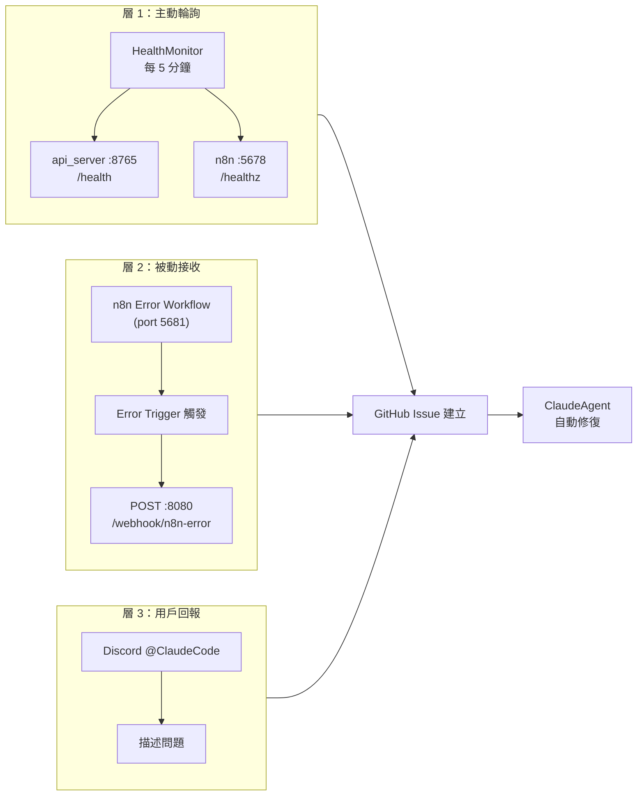
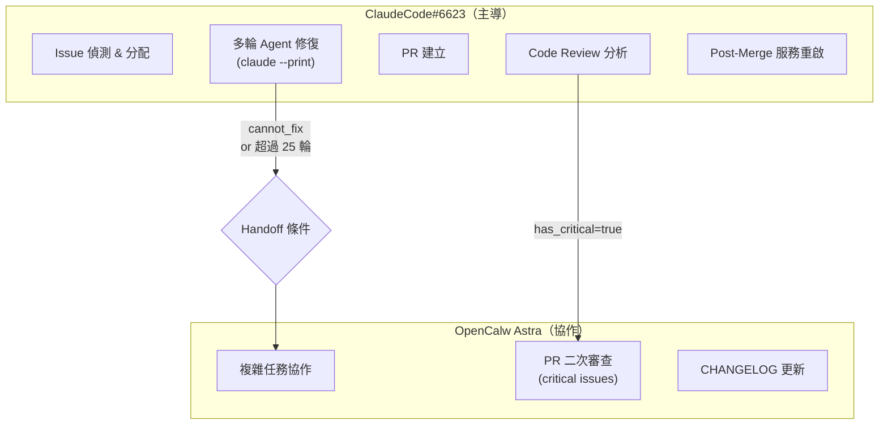

# Claude Agent 遠端自動修復工作流 — 系統流程圖

## 完整架構流程

```mermaid
flowchart TD
    %% ─── 偵測層 ─────────────────────────────────────
    subgraph DETECT["🔍 偵測層（自動觸發）"]
        D1["👤 使用者 @mention\nDiscord #agent-hub"]
        D2["⏱️ HealthMonitor\n每 5 分鐘輪詢"]
        D3["🔴 n8n Error Workflow\n任何 workflow 失敗"]
        D2A["檢查 api_server :8765\n+ n8n :5678"]
        D2B{"連續失敗\n≥ 2 次?"}
        D2 --> D2A --> D2B
    end

    %% ─── Issue 建立 ──────────────────────────────────
    subgraph ISSUE["📋 Issue 建立"]
        I1["建立 GitHub Issue\n（自動 / 手動）"]
        I2{"複雜度評估"}
        I3["simple：單檔修改"]
        I4["complex：多檔/重構"]
    end

    %% ─── Agent 修復層 ────────────────────────────────
    subgraph AGENT["🤖 ClaudeAgent 修復層（Stage 2）"]
        A1["開 Discord 討論串\nissue-#N-{title}"]
        A2["claude --print\n多輪工具呼叫"]
        A3{{"工具集"}}
        A4["list_repo_files\nread_file\nfetch_url"]
        A5["create_branch\ncommit_patch\nopen_pr"]
        A6["post_to_thread\ncannot_fix"]
        A7{"PR 建立成功?"}
        A8["⚠️ cannot_fix\n→ 人工介入通知"]
        A9["最多 25 輪\n超出 → 升級警告"]
    end

    %% ─── Code Review ────────────────────────────────
    subgraph REVIEW["🔍 Code Review（Stage 3）"]
        R1["GitHub Actions CI\nruff + ast.parse"]
        R2["ClaudeCode\n分析 PR diff"]
        R3{"有 critical\nissues?"}
        R4["OpenCalw\n二次審查"]
        R5{"verdict?"}
        R6["✅ APPROVE\nPR comment 發布"]
        R7["⚠️ REQUEST_CHANGES\n自動重試修復"]
        R8{"重試次數\n≥ 3?"}
        R9["🚨 升級至 #logs\n人工介入"]
    end

    %% ─── Auto Merge ─────────────────────────────────
    subgraph MERGE["🔀 合併層（Stage 4-5）"]
        M1["CI check_suite\ncompleted: success"]
        M2{"AutoMerger\n路徑風險評估"}
        M3["低風險路徑\nworkflows/ config/ .md"]
        M4["高風險路徑\n需人工審核"]
        M5["👤 使用者手動\nApprove & Merge"]
        M6["squash merge ✅"]
    end

    %% ─── Post Merge ─────────────────────────────────
    subgraph POST["🔄 Post-Merge 同步（Stage 5）"]
        P1["刪除 fix branch"]
        P2["關閉關聯 Issue\n(Fixes #N)"]
        P3["git pull 本機 repo"]
        P4["重啟 api_server.py\n:8765"]
        P5{"健康檢查\n(重試 8 次)"}
        P6["✅ DONE\n通知 Discord"]
        P7["❌ 重啟失敗\n通知 #logs"]
        P8["歸檔 Discord 討論串\n(10 分鐘後)"]
    end

    %% ─── Discord 通知 ───────────────────────────────
    subgraph DISCORD["💬 Discord 通知"]
        DC1["#agent-hub\n主頻道訊息"]
        DC2["#agent-hub 討論串\nAgent 工作日誌"]
        DC3["#review-queue\n待審 PR 列表"]
        DC4["#logs\n錯誤 / 升級警告"]
    end

    %% ─── 連線 ───────────────────────────────────────
    D1 --> I1
    D2B -- 是 --> I1
    D3 --> |"POST /webhook/n8n-error\n→ Flask :8080"| I1

    I1 --> I2
    I2 --> I3 --> A1
    I2 --> I4 --> A1

    A1 --> A2
    A2 --> A3
    A3 --> A4
    A3 --> A5
    A3 --> A6
    A2 --> A7
    A7 -- 是 --> R1
    A7 -- 否 --> A8
    A2 --> A9

    R1 --> R2
    R2 --> R3
    R3 -- 是 --> R4 --> R5
    R3 -- 否 --> R5
    R5 -- APPROVE --> R6
    R5 -- REQUEST_CHANGES --> R7
    R7 --> R8
    R8 -- 是 --> R9
    R8 -- 否 --> A2

    R6 --> M1
    M1 --> M2
    M2 --> M3 --> M6
    M2 --> M4 --> M5 --> M6

    M6 --> P1
    P1 --> P2
    P2 --> P3
    P3 --> P4
    P4 --> P5
    P5 -- 通過 --> P6
    P5 -- 失敗 --> P7
    P6 --> P8
    P7 --> P8

    %% Discord 通知連線
    A7 -- 是 --> DC3
    A7 -- 是 --> DC1
    A8 --> DC1
    A8 --> DC4
    R9 --> DC4
    P6 --> DC1
    P7 --> DC4
    A1 --> DC2
    D2B -- 是 --> DC4
```

---

## Self-Heal 三層偵測

```mermaid
flowchart LR
    subgraph L1["層 1：主動輪詢"]
        H1["HealthMonitor\n每 5 分鐘"]
        H2["api_server :8765\n/health"]
        H3["n8n :5678\n/healthz"]
        H1 --> H2
        H1 --> H3
    end

    subgraph L2["層 2：被動接收"]
        N1["n8n Error Workflow\n(port 5681)"]
        N2["Error Trigger 觸發"]
        N3["POST :8080\n/webhook/n8n-error"]
        N1 --> N2 --> N3
    end

    subgraph L3["層 3：用戶回報"]
        U1["Discord @ClaudeCode"]
        U2["描述問題"]
        U1 --> U2
    end

    L1 --> GH["GitHub Issue 建立"]
    L2 --> GH
    L3 --> GH

    GH --> AG["ClaudeAgent\n自動修復"]
```

---

## Bot 角色分工

```mermaid
flowchart TD
    subgraph CC["ClaudeCode#6623（主導）"]
        CC1["Issue 偵測 & 分配"]
        CC2["多輪 Agent 修復\n(claude --print)"]
        CC3["PR 建立"]
        CC4["Code Review 分析"]
        CC5["Post-Merge 服務重啟"]
    end

    subgraph OC["OpenCalw Astra（協作）"]
        OC1["複雜任務協作"]
        OC2["PR 二次審查\n(critical issues)"]
        OC3["CHANGELOG 更新"]
    end

    HAND{"Handoff 條件"}
    CC2 -- "cannot_fix\nor 超過 25 輪" --> HAND
    HAND --> OC1
    CC4 -- "has_critical=true" --> OC2
```
