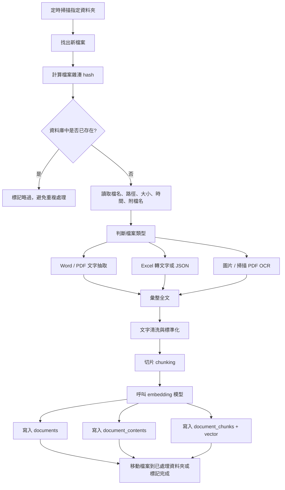

# n8n 自動存入企業文件資料庫工作流規劃

更新日期：2026-03-24

## 一、目標

本工作流的目標，是建立一條可長期運作的企業文件自動匯入流程。使用者只要將 Word、PDF、Excel、圖片檔放進指定資料夾，系統就會自動偵測新檔案，抽取內容、必要時進行 OCR、將文字切片、產生向量，並將檔案 metadata、抽出的文字、向量與權限資訊存入 PostgreSQL + pgvector。

原始檔本體不直接作為問答檢索來源，而是留存在檔案系統、NAS 或物件儲存中。資料庫主要存的是可被檢索與問答系統使用的結構化資訊。

## 二、支援的檔案類型

本工作流第一階段支援以下檔案類型：

1. Word 文件：`.docx`
2. PDF 文件：`.pdf`
3. Excel 文件：`.xlsx`、`.xls`
4. 圖片檔：`.jpg`、`.jpeg`、`.png`

其中 PDF 需要區分為文字型 PDF 與掃描型 PDF。若是掃描型 PDF，則需經過 OCR 後才能取得文字內容。圖片檔也需要經過 OCR。

## 三、整體架構

整體流程可分成六個階段：

1. 偵測新檔案
2. 讀取檔案 metadata
3. 依檔案類型抽取文字或進行 OCR
4. 清洗文字並切片
5. 使用嵌入模型產生向量
6. 將資料寫入 PostgreSQL + pgvector

## 四、工作流總覽

## 五、來源資料夾設計

建議將企業文件集中放在一個 Inbound 資料夾，例如：

`D:\AI_KB\inbox`

同時搭配以下子資料夾：

1. `inbox`：新進檔案
2. `processing`：正在處理的檔案
3. `processed`：已完成處理的檔案
4. `error`：處理失敗的檔案

這樣可以避免重複掃描、方便追蹤錯誤，也有利日後維運。

## 六、n8n 流程節點設計

### 1. Trigger：Schedule Trigger

由於 n8n 對本地檔案夾的即時監看常用做法是排程掃描，因此建議用 Schedule Trigger，每 1 分鐘或每 5 分鐘掃描一次指定資料夾。

### 2. 讀取檔案清單

使用 Execute Command 或其他可讀本地檔案清單的節點，列出指定資料夾中的檔案。此步驟應過濾副檔名，只處理支援類型。

### 3. 計算 hash

對每一個檔案計算 SHA-256 或 MD5，用來避免重複匯入相同檔案。只靠檔名不夠可靠，因為同一文件可能被改名後再次放入。

### 4. 查詢 PostgreSQL 是否已存在

根據 hash 查詢 documents 表。若已存在，直接略過；若不存在，進入後續處理。

### 5. 收集 metadata

將檔案的 metadata 整理為結構化欄位，包含：

1. file_name
2. file_ext
3. file_path
4. storage_type
5. file_size
6. mime_type
7. source_folder
8. created_time
9. modified_time
10. hash

### 6. 依檔案類型分流

#### Word

抽取段落文字與表格文字，合併為全文。

#### PDF

若可直接取得文字，走 PDF 文字抽取。若抽取結果為空或極少，則判定為掃描型 PDF，送 OCR。

#### Excel

讀取工作表內容，將每列資料轉為可檢索文字，或保留 JSON 結構後再轉文字。切勿直接將表格無處理地串成一團，否則後續檢索品質會差。

#### 圖片

送 OCR，取得文字內容。若圖片本身沒有可辨識文字，也可保留空內容並記錄 parse_status。

### 7. 文字清洗

抽出文字後，先進行清洗：

1. 去除多餘空白
2. 合併異常換行
3. 去除無意義控制字元
4. 標準化全形半形
5. 必要時保留頁碼或工作表名稱作為 metadata

### 8. 切片 chunking

建議每一份文件在進行 embedding 前先切片。切片原則可先採：

1. 每片約 500 到 1000 字元
2. chunk overlap 約 100 到 200 字元
3. PDF 可保留 page_no
4. Excel 可保留 sheet_name
5. Word 可保留 section_title

### 9. 向量化 embedding

使用本地 embedding 模型產生向量。可透過 Ollama 或其他本地推理服務提供 embedding API。

每個 chunk 都要產生一筆對應 embedding，並存入 pgvector 欄位。

### 10. 寫入 PostgreSQL

資料應寫入至少三張核心表：

1. documents：文件主檔與 metadata
2. document_contents：全文與解析狀態
3. document_chunks：切片與向量

若有部門權限需求，另寫入 document_permissions。

### 11. 搬檔或標記完成

成功後將檔案移至 processed 資料夾，失敗則移至 error，並寫入錯誤訊息。

## 七、權限資訊設計

若企業文件有權限要求，例如部門隔離、角色限制、密級控制，建議在匯入時就為每份文件加入 access metadata。

可由以下方式取得權限資訊：

1. 根據資料夾位置判斷
2. 根據檔名規則判斷
3. 根據匯入時附帶的 sidecar metadata 檔案判斷
4. 後續由管理者補填

建議至少記錄：

1. department
2. role_name
3. access_level
4. confidential_level

## 八、錯誤處理策略

工作流必須具備錯誤處理，避免因單一檔案問題而整批中斷。

建議錯誤情境包含：

1. 檔案讀取失敗
2. PDF 無法解析
3. OCR 失敗
4. embedding API 失敗
5. PostgreSQL 寫入失敗
6. 權限 metadata 不完整

遇到錯誤時，應：

1. 寫入 processing_logs 或 error log
2. 將檔案移至 error 資料夾
3. 保留錯誤訊息
4. 視需要通知管理者

## 九、建議的檔案命名規則

雖然系統可依 hash 去重，但企業端仍建議建立基本檔名規則，例如：

`部門_文件類型_主題_日期_版本.ext`

例如：

`工程部_施工規範_混凝土澆置_20260324_v1.pdf`

這樣更利於後續人工檢索與權限管理。

## 十、MVP 建議

第一版不需要把所有細節做滿，建議先完成以下最小主流程：

1. 每分鐘掃描 inbox
2. 支援 Word、文字型 PDF、圖片 OCR
3. 寫入 documents、document_contents、document_chunks
4. 先用固定權限欄位
5. 成功後移到 processed

等這條主流程穩定後，再補：

1. Excel 進階結構解析
2. 掃描 PDF 自動判斷與 OCR
3. 版本控制
4. 通知機制
5. 更完整的權限模型

## 十一、結論

這條 n8n 工作流的價值，在於把原本散落在檔案夾中的企業文件，自動轉成可被 AI 問答系統理解的知識資產。原始檔留在原本儲存系統，PostgreSQL + pgvector 則承接可檢索的文字、向量與權限資料，後續就能自然串接企業問答助理、知識查詢、客服問答與內部搜尋系統。
