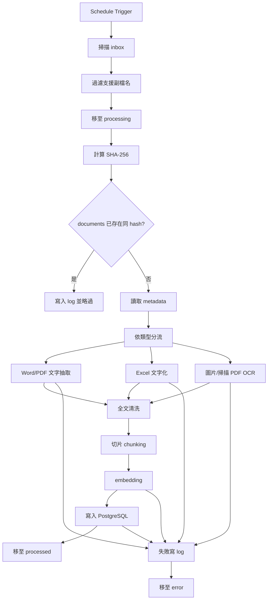

# Claude Code 開發規格書：企業文件自動匯入 PostgreSQL + pgvector

更新日期：2026-03-24

## 一、任務目標

請開發一套以 n8n 為核心的文件自動匯入流程。使用者會將 Word、PDF、Excel、圖片檔放入本地指定資料夾。系統需自動偵測新檔案，抽取內容、必要時進行 OCR、切片、向量化，最後把可供 AI 問答檢索使用的資料寫入 PostgreSQL + pgvector。

原始檔本體不存入 PostgreSQL，僅保留在檔案系統、NAS 或物件儲存。PostgreSQL 只負責存：

1. 檔案路徑
2. 檔案 metadata
3. 抽出的文字
4. chunk 切片
5. embedding 向量
6. 權限資訊
7. 處理紀錄

## 二、開發範圍

### 必做

1. 建立 n8n workflow，支援定時掃描指定資料夾
2. 讀取 Word、PDF、Excel、圖片檔
3. 支援掃描 PDF 與圖片 OCR
4. 計算 hash 去重
5. 將資料寫入 PostgreSQL
6. 文件切片與 embedding 產生
7. 錯誤處理與日誌寫入
8. 處理完成後搬移檔案

### 第一階段可簡化

1. 權限資訊可先用固定預設值
2. Excel 可先做基礎文字化，不必一開始就做最完整語意轉換
3. 先支援單一 embedding 模型
4. 先使用固定 chunk size 與 overlap

## 三、建議專案結構

若需要撰寫輔助腳本，建議規劃如下：

1. `workflows/`
   放 n8n workflow JSON 或導出檔
2. `scripts/`
   放文字抽取、OCR、chunking、embedding 呼叫相關工具腳本
3. `sql/`
   放資料庫 schema 與 migration
4. `config/`
   放環境變數說明與設定樣板
5. `docs/`
   放部署與操作說明

## 四、必要環境變數

請以環境變數管理以下參數：

1. `INGEST_INBOX_DIR`
2. `INGEST_PROCESSING_DIR`
3. `INGEST_PROCESSED_DIR`
4. `INGEST_ERROR_DIR`
5. `POSTGRES_HOST`
6. `POSTGRES_PORT`
7. `POSTGRES_DB`
8. `POSTGRES_USER`
9. `POSTGRES_PASSWORD`
10. `EMBEDDING_API_URL`
11. `OCR_API_URL` 或本地 OCR 指令設定
12. `DEFAULT_DEPARTMENT`
13. `DEFAULT_ACCESS_LEVEL`

## 五、工作流邏輯要求

### 1. 檔案掃描

工作流應能定時掃描指定資料夾，僅挑出支援副檔名的檔案。掃描後，先將待處理檔案移到 processing 資料夾，避免重複處理與並發衝突。

### 2. 檔案 metadata 擷取

每個檔案至少需取得：

1. file_name
2. file_ext
3. file_path
4. mime_type
5. file_size
6. source_folder
7. created_time
8. modified_time

### 3. 去重

需對檔案計算 SHA-256。若 documents 表中已存在相同 hash_sha256，則記錄 log 並略過。

### 4. 文字擷取

#### Word

抽取正文與表格文字。

#### PDF

優先做直接文字擷取。若結果接近空值，判斷為掃描 PDF，改走 OCR。

#### Excel

將每個工作表讀成列資料，轉為可檢索的文字。請保留 sheet_name metadata。

#### 圖片

送 OCR。若 OCR 無結果，也需保留 parse_status 與錯誤資訊。

### 5. 文字清洗與切片

文字抽出後，需做基礎清洗，並依固定規則切片。建議：

1. chunk size：500 到 1000 字元
2. overlap：100 到 200 字元

切片結果需保留：

1. chunk_index
2. chunk_text
3. page_no 或 sheet_name
4. section_title
5. metadata

### 6. embedding

對每個 chunk 呼叫 embedding 模型，取得向量後存入 document_chunks.embedding。

如模型實際輸出維度與 SQL 預設不一致，需同步調整 schema。開發時請勿硬寫死為不可替換實作。

### 7. 寫入資料庫

需依序寫入：

1. `documents`
2. `document_contents`
3. `document_chunks`
4. `document_permissions`
5. `processing_logs`

需確保交易一致性，至少避免出現 documents 已建立但 chunk 全失敗卻無紀錄的狀況。

### 8. 搬檔與錯誤處理

成功後將檔案移到 processed，失敗則移到 error。無論成功或失敗，都需留下 processing_logs。

## 六、n8n 模組拆分建議

建議將 workflow 或子流程模組化，至少分成：

1. 檔案掃描模組
2. metadata 與 hash 模組
3. 文件解析模組
4. OCR 模組
5. 文字切片模組
6. embedding 模組
7. PostgreSQL 寫入模組
8. 錯誤處理模組

若 n8n 本身不適合承載過重的文字處理，可透過 Execute Command 或 HTTP Request 呼叫本地腳本服務。

## 七、實作注意事項

1. 不可只靠檔名判斷是否重複，必須用 hash
2. 不可將原始檔二進位直接塞進 PostgreSQL 當主要做法
3. 圖片與掃描 PDF 一定要有 OCR 分支
4. Excel 需保留 sheet_name，避免語意遺失
5. 大檔案需避免一次將整份文本全部送入模型
6. 錯誤不能中斷整批流程，應單檔隔離
7. 權限資訊即使第一版簡化，也要先留欄位

## 八、驗收標準

完成後需至少滿足以下驗收條件：

1. 放入一個 Word 檔，可成功建立 documents、document_contents、document_chunks
2. 放入一個文字型 PDF，可成功抽文與向量化
3. 放入一個掃描型 PDF 或圖片，可成功走 OCR 分支
4. 放入一個 Excel，可保留工作表資訊並完成 chunk
5. 重複放入同一檔案時，不會重複建立 documents
6. 處理失敗的檔案會移到 error，且資料庫有 log
7. 成功的檔案會移到 processed

## 九、Mermaid 流程圖

## 十、交付物要求

請至少交付以下成果：

1. 可匯入的 n8n workflow 檔
2. PostgreSQL schema 或 migration
3. 必要的輔助腳本
4. `.env.example`
5. 部署說明文件
6. 測試方式說明

## 十一、結論

本任務的核心不是單純把檔案搬進資料庫，而是要建立一條可穩定運作的文件知識化流程。請以「原始檔留在儲存系統、可檢索內容進 PostgreSQL + pgvector」為主原則實作，並預留後續串接企業問答助理與權限檢索的擴充空間。
