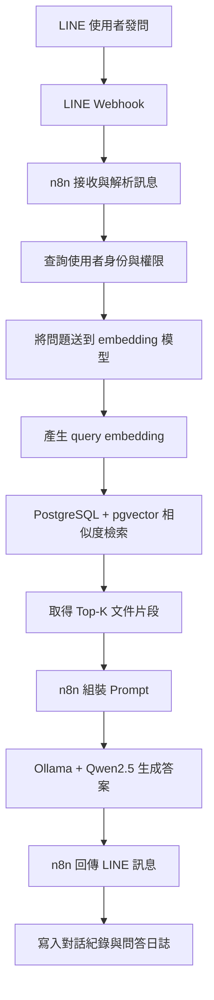
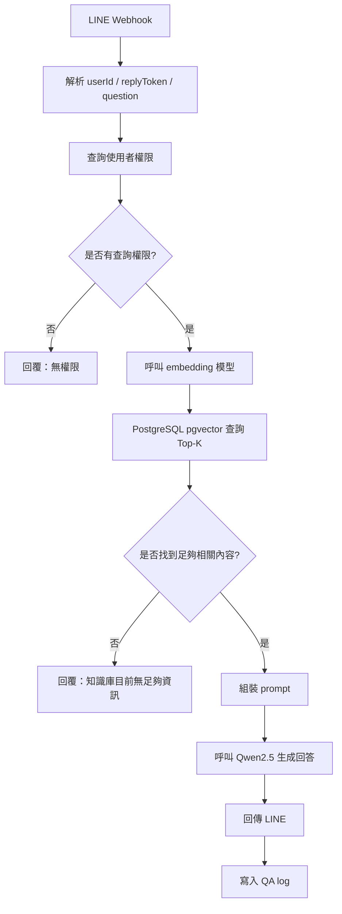

# 企業問答助理：LINE + n8n + Ollama/Qwen2.5 + 向量庫 工作流設計

更新日期：2026-03-24

## 一、專案目標

本系統的目標，是建立一套企業內部可用的問答助理，讓使用者透過 LINE 發問後，系統能自動理解問題、從向量資料庫檢索最相關的企業文件內容，再由本地 LLM 生成回答，最後透過 LINE 回傳答案。

本系統整合三個核心模組：

1. Ollama + Qwen2.5 + 嵌入模型
   提供本地語言模型推理與 embedding 向量生成能力。

2. PostgreSQL + pgvector
   儲存文件切片、向量、metadata 與可供檢索的知識內容。

3. n8n AI Agent 工作流
   負責串接 LINE webhook、本地模型、向量查詢、回答生成與對話紀錄。

## 二、問答系統定位

這套系統屬於 RAG 型企業問答助理。也就是說，系統不是單靠模型本身記憶回答，而是會先去企業知識庫中找出相關內容，再把這些內容當作上下文交給 Qwen2.5 生成最終答案。

這樣的好處是：

1. 回答更貼近公司內部文件
2. 降低模型亂答的風險
3. 可隨文件更新而同步提升問答品質
4. 可搭配權限控制，限制不同使用者看到的知識內容

## 三、主要使用情境

第一階段主要情境是企業內部問答，例如：

1. 人員詢問公司流程
2. 查詢 SOP、合約說明、制度文件
3. 查詢專案規範、工程文件、作業指引
4. 查詢內部常見問題
5. 查詢特定主題的文件摘要

使用者透過 LINE 傳送自然語言問題，系統即自動回傳整理後答案，必要時附上參考文件片段或來源。

## 四、整體架構

## 五、核心工作流程

### 1. LINE 收訊

使用者從 LINE 官方帳號送出訊息，例如：

`公司請假流程怎麼走？`

LINE 將 webhook 傳給 n8n。n8n 先解析事件內容，取得：

1. userId
2. replyToken
3. 訊息文字
4. 訊息時間

### 2. 使用者驗證與權限判斷

在正式環境中，建議先依 userId 查詢使用者身份與角色。若未登入或未授權，可直接回覆「無權限查詢」或限制可查內容範圍。

這一層的目的，是避免高機密文件被所有 LINE 使用者查詢。

### 3. 問題向量化

n8n 將使用者問題送給本地 embedding 模型，由 Ollama 或本地 embedding 服務產生 query vector。

例如：

`公司請假流程怎麼走？`

先轉為對應的 embedding 向量，再拿去 pgvector 中做相似度查詢。

### 4. 向量檢索

在 PostgreSQL + pgvector 中，根據 query embedding 查詢最相近的文件片段。可依照權限、部門、文件分類等條件做過濾。

通常可先取 Top 5 或 Top 10 chunk。

### 5. Prompt 組裝

n8n 把以下資訊整理成 prompt：

1. 使用者問題
2. 檢索到的文件片段
3. 回答規則
4. 回答語氣與格式要求

這裡建議加入明確限制，例如：

1. 只能根據提供的內容回答
2. 若資訊不足，要明確說明
3. 不可自行捏造公司政策
4. 盡量附上來源片段編號

### 6. LLM 回答生成

將組裝好的 prompt 傳給本地 Qwen2.5 模型，生成最終回答。必要時可要求模型輸出結構化格式，例如：

1. answer
2. confidence
3. source_refs
4. need_human_review

### 7. 回覆使用者

n8n 將模型輸出的 answer 組裝成適合 LINE 的回覆格式，再回傳給使用者。

若答案過長，可拆成多段訊息。若找不到足夠內容，也可回覆「目前知識庫沒有足夠資訊，請洽管理者」。

### 8. 寫入紀錄

每次問答都應寫入問答日誌，方便後續分析、優化 prompt、檢查檢索品質與回覆品質。

## 六、n8n 模組拆分建議

### 模組一：LINE Webhook Ingress

負責接收 LINE webhook、驗證事件格式、抽取 userId 與文字訊息。

### 模組二：User Resolver

負責查詢使用者身份、部門、角色、權限範圍。

### 模組三：Query Embedding

負責把使用者問題送進 embedding 模型，取得 query vector。

### 模組四：Vector Search

負責使用 pgvector 做向量檢索，依照相似度找出最相關 chunk。

### 模組五：Prompt Builder

負責整理使用者問題、檢索結果與回答規則，組裝最終 prompt。

### 模組六：Answer Generator

負責呼叫本地 Qwen2.5 模型，生成答案。

### 模組七：Reply Dispatcher

負責將最終答案回傳 LINE。

### 模組八：QA Logging

負責紀錄問題、檢索結果、最終回答、模型信心與來源片段。

## 七、建議回答規則

為避免模型亂答，建議在 prompt 中強制加入以下規則：

1. 只能根據檢索到的內容回答
2. 若內容不足，不可自行補充未驗證資訊
3. 若問題涉及公司承諾、法務、財務、合約責任，需保守回答
4. 優先給摘要，再補重點條列
5. 回答中可標示參考來源片段

## 八、查無資料時的策略

若向量檢索結果的相似度太低，或沒有足夠內容，系統應避免硬生成答案。

建議策略如下：

1. 回覆目前知識庫沒有明確資料
2. 提示使用者換句話問
3. 建立待補知識問題清單
4. 視需要轉人工處理

## 九、對話記憶建議

第一階段不需要過度複雜的長期記憶，但至少應保留以下資訊：

1. 最近幾輪對話
2. 使用者身份與部門
3. 問題類型
4. 已檢索的來源片段
5. 模型回覆內容

若同一使用者持續追問，n8n 應能將最近一到三輪對話帶入 prompt，避免答非所問。

## 十、建議的 n8n 主流程圖

## 十一、MVP 建議

第一版可先以最小可用流程實作：

1. LINE 接收文字訊息
2. 將問題轉 embedding
3. 到 PostgreSQL + pgvector 檢索 Top 5 chunk
4. 用 Qwen2.5 生成回答
5. 回答回傳給 LINE
6. 寫入 QA log

先不要一開始就做太多高階功能，例如多輪長記憶、複雜權限矩陣、進階 reranking。等主流程穩定後，再逐步補強。

## 十二、結論

這套企業問答助理的核心，不是單純把模型接到 LINE，而是讓 n8n 成為整體 AI Agent 的流程中樞：前面接 LINE、後面接向量庫與本地模型，中間做權限、檢索、上下文組裝與日誌記錄。這樣才能讓本地 Qwen2.5 真正成為有依據、可控、可維運的企業知識問答系統。
