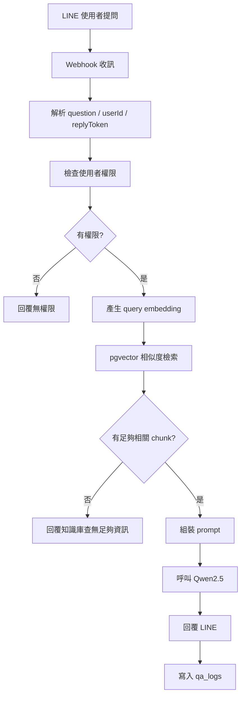

# Claude Code 開發規格書：企業問答助理 LINE + n8n + 向量庫

更新日期：2026-03-26

> **實作狀態：✅ 全部完成**
> 問答流程、文件匯入流程、自動備份均已完成部署與測試。

## 一、任務目標

請開發一套企業問答助理系統，讓使用者能透過 LINE 官方帳號提出問題，系統使用 n8n 串接本地 Ollama + Qwen2.5 模型與 PostgreSQL + pgvector，先做向量檢索，再由本地 LLM 生成回答，最後回覆到 LINE。

本系統採 RAG 架構，不可只依賴模型內部知識回答。模型必須優先根據檢索到的企業文件片段生成答案。

## 二、系統組成

本系統包含以下核心元件：

1. LINE Messaging API
   作為使用者問答入口。

2. n8n
   作為 AI Agent 流程引擎，負責訊息接收、檢索、prompt 組裝、模型呼叫、回覆與記錄。

3. Ollama + Qwen2.5
   作為本地生成模型。

4. Embedding 模型
   用來產生 query embedding。

5. PostgreSQL + pgvector
   作為向量檢索與知識片段儲存庫。

## 三、開發範圍

### 必做功能

1. 接收 LINE webhook
2. 解析使用者問題
3. 呼叫 embedding 模型產生 query vector
4. 到 pgvector 進行相似度搜尋
5. 取得 Top-K chunk
6. 組裝 prompt
7. 呼叫 Qwen2.5 生成回答
8. 回覆到 LINE
9. 記錄 QA log

### 第一階段可簡化

1. 使用者權限先支援基本角色驗證
2. 多輪上下文先只帶最近 1 到 3 輪
3. 先不做 reranker
4. 先不做複雜人工審核流程

## 四、環境變數需求

請以環境變數管理以下設定：

1. `LINE_CHANNEL_ACCESS_TOKEN`
2. `LINE_CHANNEL_SECRET`
3. `OLLAMA_BASE_URL`
4. `OLLAMA_CHAT_MODEL`
5. `OLLAMA_EMBED_MODEL`
6. `POSTGRES_HOST`
7. `POSTGRES_PORT`
8. `POSTGRES_DB`
9. `POSTGRES_USER`
10. `POSTGRES_PASSWORD`
11. `QA_TOP_K`
12. `QA_MIN_SIMILARITY`
13. `DEFAULT_NO_ANSWER_MESSAGE`

## 五、工作流邏輯要求

### 1. Webhook 接收

需建立 n8n webhook workflow，處理 LINE 傳入的文字訊息事件。需解析：

1. userId
2. replyToken
3. messageText
4. timestamp

若不是文字訊息，可先忽略或回覆「目前僅支援文字提問」。

### 2. 使用者識別

需預留使用者權限查詢模組。第一版至少支援：

1. 根據 userId 查詢是否為允許的使用者
2. 回覆無權限訊息

此部分可接資料表或先用簡化白名單方式實作，但不可完全省略。

### 3. Query embedding

需將使用者問題送至 embedding 模型，取得向量。此實作需與 Ollama 或其他本地 embedding 服務兼容，不應綁死某單一實作細節。

### 4. Vector search

需對 PostgreSQL + pgvector 發出查詢，取回最相關的 Top-K chunk。查詢時應考慮：

1. 相似度排序
2. 可選的最小相似度門檻
3. 權限過濾欄位
4. metadata 一併回傳

### 5. Prompt 組裝

需將以下內容組裝成最終 prompt：

1. 使用者問題
2. 檢索到的 chunk 內容
3. 回答規則
4. 安全限制

Prompt 必須要求模型：

1. 只能根據提供內容回答
2. 若資訊不足，必須明確說明不知道
3. 不得捏造公司政策
4. 盡量條列重點

### 6. LLM 回答生成

需呼叫 Qwen2.5，生成答案。建議模型輸出至少包含：

1. answer
2. confidence
3. source_refs

若開發上先只輸出 answer 也可，但需預留後續可擴充結構化輸出的能力。

### 7. LINE 回覆

需使用 replyToken 將答案回傳給 LINE。若答案過長，需做分段或截斷策略，避免超出訊息限制。

### 8. QA 日誌

每次問答至少需記錄：

1. userId
2. question
3. query embedding 是否成功
4. retrieved chunk IDs
5. final answer
6. created_at

## 六、資料表依賴

本任務依賴既有 PostgreSQL + pgvector 文件資料庫，至少要能查詢：

1. `document_chunks`
2. `documents`
3. 權限欄位或對應表

若需要新增問答紀錄表，建議如下：

`qa_logs`
- `id`
- `user_id`
- `question`
- `retrieved_chunk_ids`
- `answer`
- `confidence`
- `created_at`

## 七、n8n 模組拆分建議

請盡量模組化設計 workflow 或子流程，至少拆成：

1. LINE ingress
2. auth / user resolver
3. embedding requester
4. vector search
5. prompt builder
6. llm answer generator
7. line reply dispatcher
8. qa logger

若 n8n 本身不適合進行複雜 prompt 組裝，可搭配 Code 節點或外部本地 API。

## 八、回答品質要求

系統應符合以下原則：

1. 優先正確，不追求華麗措辭
2. 無資料時寧可保守回答，也不要硬編
3. 盡量引用檢索到的內容
4. 回答需適合企業內部使用
5. 避免產生明顯與來源不一致的資訊

## 九、失敗處理

需處理以下失敗情境：

1. LINE webhook 格式錯誤
2. embedding API 失敗
3. PostgreSQL 查詢失敗
4. 查無足夠相關內容
5. LLM 推理失敗
6. LINE 回覆失敗

失敗時至少要：

1. 寫入 log
2. 回覆適當錯誤訊息或保底訊息
3. 避免整條 workflow 靜默失敗

## 十、Mermaid 流程圖

## 十一、驗收標準

完成後，系統至少需滿足：

1. 從 LINE 傳入問題後，可成功進到 n8n
2. 可對問題產生 embedding
3. 可從 pgvector 撈出 Top-K chunk
4. 可用 Qwen2.5 根據檢索結果生成回答
5. 可成功回覆到 LINE
6. 可寫入 QA log
7. 查無資料時不亂答

## 十二、交付物

請至少交付以下內容：

1. 可匯入的 n8n workflow 檔
2. `.env.example`
3. 需要的 SQL 或資料表補充說明
4. 部署說明
5. 測試說明

## 十三、結論

本任務重點在於把 LINE、n8n、本地 Qwen2.5 與向量資料庫串成一條穩定可用的企業問答流程。請優先確保檢索與回答鏈條可用，再逐步優化權限、多輪上下文與回答品質。

---

## 十四、驗收結果（2026-03-26）

### ✅ 全部驗收通過

| 驗收項目 | 結果 |
|---|---|
| LINE 問題進入 n8n | ✅ |
| embedding 向量化 | ✅ bge-m3（1024 維） |
| pgvector Top-K 檢索 | ✅ 含檔名過濾、相似度閾值 |
| Qwen2.5 生成回答 | ✅ qwen2.5:7b-instruct-q4_0 |
| LINE 回覆 | ✅ 含 Quick Reply 選單 |
| QA log 寫入 | ✅ qa_logs 資料表 |
| 查無資料不亂答 | ✅ 回覆「目前知識庫中沒有相關資料」 |

### 實際交付物清單

| 檔案 | 說明 |
|---|---|
| `workflows/qa_workflow.json` | LINE 問答 n8n workflow（40 節點） |
| `workflows/ingest_workflow_v2.json` | 文件自動匯入 workflow（每小時） |
| `workflows/backup_workflow.json` | 資料庫自動備份 workflow（每天凌晨 2:00） |
| `scripts/api_server.py` | Python HTTP API Server（9 個端點） |
| `scripts/extract_text.py` | 文字抽取（PDF/Word/Excel/圖片 OCR） |
| `scripts/chunk_text.py` | 文字切片 |
| `scripts/embed_chunks.py` | Ollama Embedding |
| `scripts/write_to_db.py` | 寫入 PostgreSQL + pgvector |
| `scripts/backup_db.py` | pg_dump 備份腳本 |
| `config/.env.example` | 環境變數範本 |
| `n8n自動存入資料庫/02_postgresql_schema.sql` | 完整資料庫 Schema（7 張資料表） |
| `start_api_server.bat` | Windows 啟動腳本 |
| `start_ngrok.bat` | ngrok tunnel 啟動腳本 |

### 額外完成的功能（規格書外）

- **子資料夾自動分類**：文件收件匣的子資料夾名稱自動成為 `department` 標籤
- **檔案下載 API**：`GET /files/<name>` 供 LINE Bot 提供原始檔案下載連結
- **檔名關鍵字搜尋**：`POST /search-files` 供用戶查找特定文件
- **指定檔案問答**：LINE Quick Reply「問:檔名」功能，針對單一文件提問
- **Session 狀態機**：多輪對話記憶，自動追蹤用戶當前操作模式
- **授權用戶管理**：`allowed_users` 資料表控制 LINE Bot 存取權限
- **開機自動啟動**：Windows Startup 設定，重開機後所有服務自動恢復
